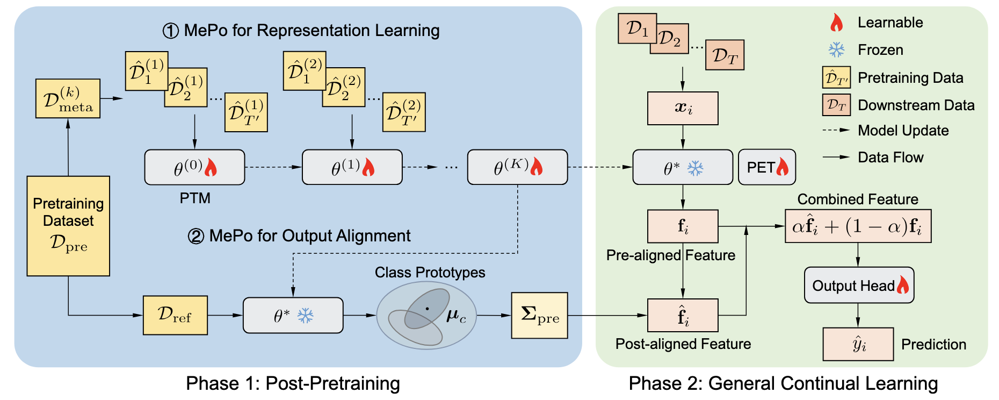

# MePo: Meta Post-Refinement for General Continual Learning (GCL)

<p align="center">
  <a href="https://arxiv.org/abs/2602.07940"></a>
  <a href="https://huggingface.co/long2333/MePo"></a>
  <a href="https://github.com/SunGL001/MePo"></a>
  <a href="LICENSE"></a>
</p>


<p align="center"> <b>Guanglong Sun<sup>1,2</sup>, Hongwei Yan<sup>1,2</sup>, Liyuan Wang<sup>†3</sup>, Zhiqi Kang<sup>4</sup>, Shuang Cui<sup>5</sup>, Hang Su<sup>6</sup>, Jun Zhu<sup>6</sup>, Yi Zhong<sup>†1,2</sup></b> </p>

<p align="center"> <sup>1</sup>Tsinghua University, <sup>2</sup>Tsinghua–Peking Joint Center for Life Sciences, <sup>3</sup>Dept. of Psychology, Tsinghua, <sup>4</sup>Inria, <sup>5</sup>ISCAS, <sup>6</sup>Dept. of CS, Tsinghua </p>

<p align="center"> (†</sup>Corresponding Author) </p>


Official PyTorch implementation of our paper for **General Continual Learning (GCL)**.

**MePo** (**Me**ta **Po**st-Pretraining) improves GCL with three components: **Meta-Learning for Representation Learning**, **Meta Covariance Initialization**, and **Feature Alignment**. The meta post-pretraining stage adapts the backbone to a more GCL-friendly representation before downstream continual learning.

<p align="center">
  
</p>


<p align="center">
  
  &nbsp;&nbsp;&nbsp;&nbsp;
  
</p>


## 📦 What's included

- **Meta post-pretraining**: Reptile-style meta-learning on the backbone (`meta_post_training.py`)
- **Meta covariance**: Second-order statistics for pretrained representations (`meta_corvariance.ipynb`)
- **Downstream GCL**: Integration with MISA, DualPrompt, and other prompt-based methods (see `GCL/`)
- **Backbones**: ViT (Sup-21K, Sup-1K, iBOT, DINO, etc.) via `timm` and local `GCL/models/vit.py`
- **Datasets**: CIFAR-10/100, Tiny-ImageNet, ImageNet-R, CUB-200, CARS196, NCH, GTSRB, WikiArt, and more

## 🛠️ Installation (Linux)

### Requirements

- **Python**: 3.10+
- **PyTorch / CUDA**: Follow the [official PyTorch instructions](https://pytorch.org/get-started/locally/) for your CUDA version, then install the rest of the dependencies.

### Option 1: Conda (recommended)

```bash
conda env create -f environment.yml
conda activate misa
```

### Option 2: pip + venv

```bash
pip install -r requirements_pip.txt
```

**Note:** `requirements_pip.txt` includes PyTorch. If you prefer installing PyTorch from a specific CUDA wheel index, install PyTorch first, then install the remaining packages.

## 🗂️ Datasets

Downstream GCL uses `--data_dir` as the **dataset root**. Different datasets expect different subdirectory layouts.

### Recommended directory layout

```text
MePo/
  data/                    # or set via --data_dir
    CIFAR/                 # CIFAR-10/100 (torchvision)
    imagenet-r/            # ImageNet-R (train/, test/, with class subdirs)
    CUB_200_2011/          # CUB-200-2011
      images/
        <class_name>/*.jpg
    CARS196/               # CARS196 (scripts may use split_imgs, etc.)
```

Common dataset names in scripts: `cifar10`, `cifar100`, `tinyimagenet`, `imagenet-r`, `cub200`, `cars196`, `nch`, `gtsrb`, `wikiart`.

## 🧩 Checkpoints (pretrained backbones & MePo outputs)

### Released pre-trained models and covariance matrices

We release meta-trained backbones, precomputed covariance matrices, and MISA prompt weights for direct use in downstream GCL. **Total size ~2.08 GB**.

**Download:**

- **Hugging Face**: [MePo Checkpoints (mepo_ckps)](https://huggingface.co/long2333/MePo/tree/main/mepo_ckps)

#### Release layout

The `mepo_ckps/` directory on Hugging Face has the following structure:

```text
mepo_ckps/                    # 
  e_prompt.pt                 # MISA e-prompt weights
  g_prompt.pt                 # MISA g-prompt weights
  ibot21k/                    # iBOT-21K backbone weights and covariance
  sup1k/                      # Sup-1K backbone weights and covariance
  sup21k/                     # Sup-21K backbone weights and covariance
    cov_sup21k_meta_5.npy     # Covariance matrix
    vit_sup21k_meta_0.pth     # Naive pretrained backbone checkpoint
    vit_sup21k_meta_5.pth     # Meta backbone checkpoint
```

The `ibot21k/` and `sup1k/` directories follow the same naming: `cov_*.npy` and `vit_*.pth` (see the repo for exact filenames).

#### Where to put the files

Download the full `mepo_ckps` folder and place it locally (e.g. under `checkpoints/`), keeping the structure above:

```text
MePo/
  checkpoints/                # or any path; match the variables in your scripts
    mepo_ckps/
      e_prompt.pt
      g_prompt.pt
      ibot21k/
      sup1k/
      sup21k/
        cov_sup21k_meta_5.npy
        vit_sup21k_meta_0.pth
        vit_sup21k_meta_5.pth
```

In `GCL/scripts/misa_mepo.sh` (or your run script), set:

- **`META_PATH`**: Path to the meta backbone, e.g. `checkpoints/mepo_ckps/sup21k/vit_sup21k_meta_5.pth`
- **`COR_PATH`**: Path to the covariance matrix, e.g. `checkpoints/mepo_ckps/sup21k/cov_sup21k_meta_5.npy`
- **`LOAD_PT`** (for MISA): Path to the directory containing `e_prompt.pt` and `g_prompt.pt` (e.g. `checkpoints/mepo_ckps/`); see `--load_pt` in the script.

**Note:** `checkpoints/` is usually in `.gitignore`; download and place the files manually.

#### Released checkpoint list

| Backbone / config | Meta backbone (.pth) | Covariance (.npy) | Notes |
| ----------------- | -------------------- | ----------------- | ----- |
| Sup-21K           | `sup21k/vit_sup21k_meta_0.pth`, `vit_sup21k_meta_5.pth` | `sup21k/cov_sup21k_meta_5.npy` | Corresponds to meta epoch 0/5 |
| Sup-1K            | `sup1k/vit_sup1k_meta_*.pth`   | `sup1k/cov_sup1k_meta_*.npy`   | See HF repo for exact filenames |
| iBOT-21K          | `ibot21k/vit_ibot21k_meta_*.pth` | `ibot21k/cov_ibot21k_meta_*.npy` | See HF repo for exact filenames |

MISA **e-prompt** and **g-prompt** are included in the release: `mepo_ckps/e_prompt.pt`, `mepo_ckps/g_prompt.pt`.

---

### Pretrained ViT (upstream, for meta post-pretraining)

- **Pretrained ViT**: e.g. Sup-21K `ViT-B_16.npz`, iBOT `checkpoint.pth`. Download and place them locally, and set the paths in `meta_post_training.py` (e.g. `checkpoint_path`).

### MePo outputs (when you train yourself)

- **Meta-trained backbone**: Saved under `save_path` (default in code: `/data/meta_vit2`). You can change `save_path` in `meta_post_training.py`.
- **Covariance matrix**: Produced by `meta_corvariance.ipynb`. Use `--cor_path` and `--pretrain_cor` in downstream GCL.

## 🚀 Quick start

### Stage 1: Meta-Learning for Representation Learning

Run meta post-pretraining on the backbone. Outputs are written to `save_path`:

```bash
python ./meta_post_training.py \
  -gpu_ids '0,1' \
  -inner_lr 0.1 \
  -num_tasks 50 \
  -model 'sup' \
  -epochs 50 \
  -num_inner_steps 1 \
  -samples 200
```

Common `-model` options: `sup` (Sup-21K), `sup1k`, `ibot`, `dino`. Adjust `-num_tasks`, `-samples`, and `-epochs` as needed.

### Stage 2: Meta Covariance Initialization

Approximate second-order statistics of (meta-)pretrained representations for downstream use:

- Open and run **`meta_corvariance.ipynb`** to generate the covariance matrix (e.g. `cov_matrix_backbone*.npy`).

### Stage 3: Downstream GCL training and evaluation

Run scripts under `GCL/`, or refer to [FlyGCL/FlyPrompt](https://github.com/AnAppleCore/FlyGCL) to swap the pretrained backbone with the MePo backbone.

**Example: MISA + MePo backbone (this repo):**

```bash
cd ./GCL
CUDA_VISIBLE_DEVICES=0 bash scripts/misa_mepo.sh
```

Before running, set the following in `scripts/misa_mepo.sh`:

- `META_PATH`: Path to MePo backbone weights (e.g. `meta_epoch_2.pth`)
- `COR_PATH`: Path to covariance matrix (e.g. `cov_matrix_backbone2.npy`)
- `DATA_DIR`: Dataset root (same as `--data_dir`)
- `DATASET`: e.g. `imagenet-r`, `cifar100`

## 🏃 Scripts

- **`meta.sh`**: Launches meta post-pretraining with different configs (you may point it to `meta_post_training.py` if you have consolidated scripts).
- **`GCL/scripts/`**: Downstream CIL scripts (e.g. `misa_mepo.sh`, `misa.sh`, `l2p_*.sh`, `mvp_*.sh`, `codaprompt.sh`). Edit script variables or pass arguments to set dataset and data path.

Example with environment variables:

```bash
export DATA_ROOT=/path/to/your/data
cd GCL && CUDA_VISIBLE_DEVICES=0 bash scripts/misa_mepo.sh
```

## 🔧 Key arguments

**Meta post-pretraining (`meta_post_training.py`)**

| Argument           | Description                          | Example    |
| ------------------ | ------------------------------------ | ---------- |
| `-gpu_ids`         | GPU IDs                              | `'0,1'`    |
| `-model`           | Pretrained model                     | `sup` \| `sup1k` \| `ibot` \| `dino` |
| `-inner_lr`        | Outer-loop learning rate             | `0.1`      |
| `-num_tasks`       | Number of meta tasks                 | `50`       |
| `-samples`         | Samples per class                    | `200`      |
| `-epochs`          | Meta-training epochs                 | `50`       |
| `-num_inner_steps` | Inner-loop steps                     | `1`        |

**Downstream GCL (`GCL/main.py`)**

| Argument        | Description                          |
| --------------- | ------------------------------------ |
| `--mode`        | Method (e.g. DualPrompt)             |
| `--dataset`     | Dataset name                         |
| `--data_dir`    | Dataset root                         |
| `--n_tasks`, `--n`, `--m` | Task count and Si-Blurry split  |
| `--meta_path`   | MePo backbone checkpoint             |
| `--cor_path`, `--pretrain_cor`, `--cor_coef` | Covariance matrix and coefficient |
| `--load_pt`     | Load prompts (e.g. MISA g/e prompts) |

## 📁 Outputs

- **Meta post-pretraining**: Checkpoints under `save_path/model_id/` (e.g. `meta_epoch_*.pth`), controlled by `save_path` and `model_id` in `meta_post_training.py`.
- **Covariance**: Path is set in `meta_corvariance.ipynb` (e.g. `cov_matrix_backbone*.npy`).
- **Downstream GCL**: Logs and results follow `--log_path` and script redirection (e.g. `results/` or paths in the script).

## 🧱 Project layout

```text
MePo/
  meta_post_training.py    # Stage 1: meta-learning representation
  meta_corvariance.ipynb   # Stage 2: covariance initialization
  meta.sh                  # Meta-training script examples
  environment.yml          # Conda environment
  requirements_pip.txt     # pip dependencies
  utils/                   # Utilities for meta-learning
  GCL/                     # Downstream GCL code
    main.py                # Entry point
    configuration/         # Config and arguments
    methods/               # MISA, L2P, DualPrompt, CoDA, MVP, etc.
    models/                # ViT, prompts, etc.
    datasets/              # Dataset loaders
    scripts/               # misa_mepo.sh and other run scripts
```

## 🙏 Acknowledgements

We thank the authors and maintainers of MISA(https://github.com/kangzhiq/MISA), FlyGCL(https://github.com/AnAppleCore/FlyGCL), and related open-source projects and datasets.

## 📝 Citation

If this repository helps your research, please cite our paper:

```bibtex
@misc{sun2026mepometapostrefinementrehearsalfree,
      title={MePo: Meta Post-Refinement for Rehearsal-Free General Continual Learnin}, 
      author={Guanglong Sun and Hongwei Yan and Liyuan Wang and Zhiqi Kang and Shuang Cui and Hang Su and Jun Zhu and Yi Zhong},
      year={2026},
      eprint={2602.07940},
      archivePrefix={arXiv},
      primaryClass={cs.AI},
      url={https://arxiv.org/abs/2602.07940}, 
}
```

## ✉️ Contact

For questions or suggestions, please open an issue or contact the maintainers.

## 📄 License

See the `LICENSE` file in the project root.
